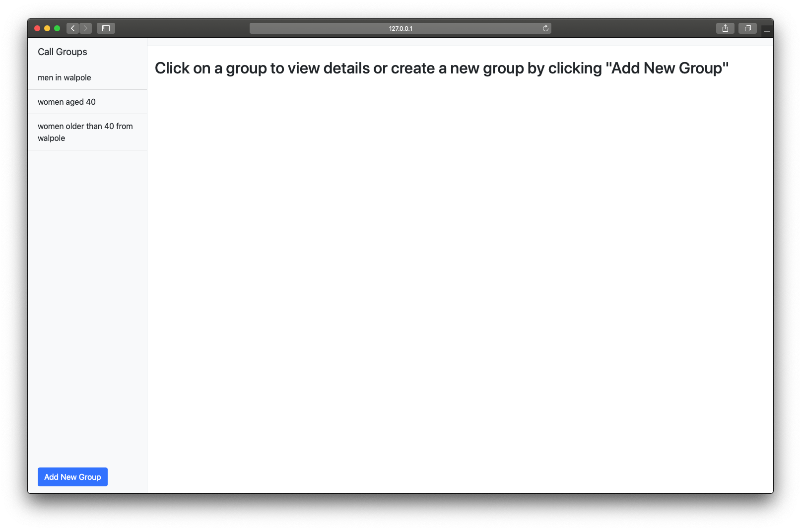
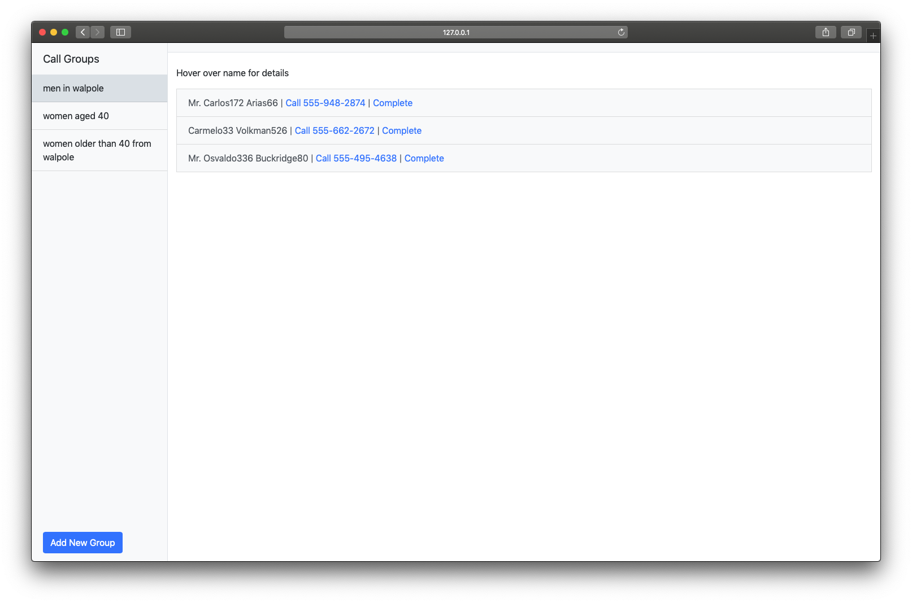
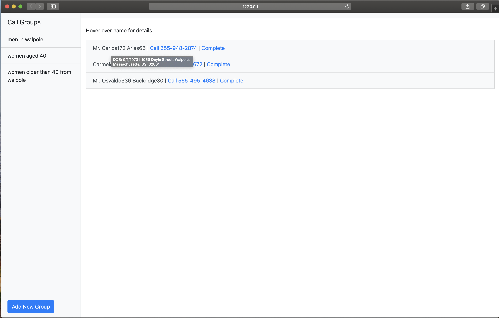
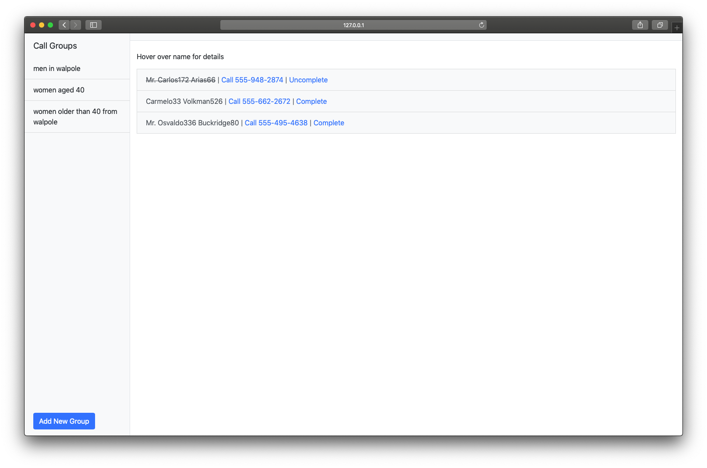
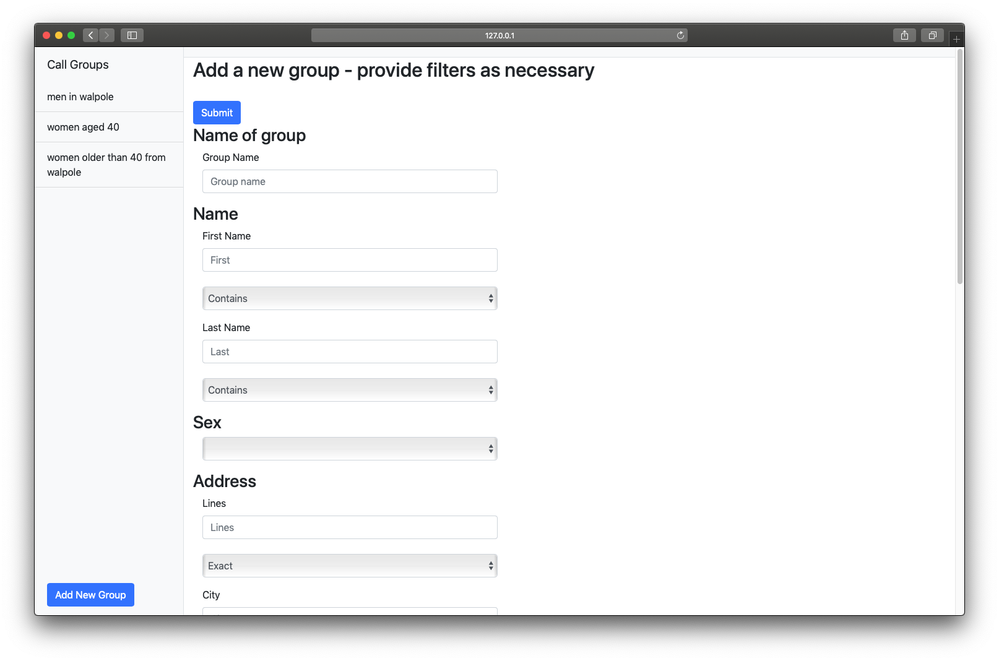

# Patient Call Lists

My submission for the UCL FHIR Hack 2020 as part of Systems Engineering.

This web app aims to make the process of calling patients, either for booking appointments, checkups, or any other purpose, much more straightfoward. Some examples of where this be used include setting up vaccinations for groups in particular areas and age ranges, or following up with patients that have been released from care.

A form is used to generate a list of patients against a set of filters, from there, a patient can be called directly through embedded Skype URIs and checked off. This allows medical staff to keep
track of who has been called already and who still needs to be contacted. 


##Features

This app is a proof of concept for this idea. This is what the app looks like, with a few lists I have already generated. 



Homescreen of application


Selected group


Mouse hover over patient name


Pressing "Complete" link


Form to generate new list


## Getting Started


### Prerequisites

This project uses Python 3.7.5 along with Flask and FHIR_Parser. Dependencies can ben installed from the requirements.txt file.

```
pip install -r requirements.txt
```

This project also requires .NET for the API to access FHIR data, explained below.

### Installing

GOSH Drive created a .NET API to access FHIR data, the repository for that can be found here: https://github.com/goshdrive/FHIRworks_2020

User greenfrogs created a fork of this repository, which disables HTTPS and includes cashing to speed up response times, as such I recommend you use his version, found here: https://github.com/greenfrogs/FHIRworks_2020

The deployment guide featured in the repository explains how to get the server up and running.


## Deployment

To run the .NET API service, navigate to FHIRworks_2020/dotnet-azure-fhir-web-api and run:
```
dotnet run
```
The server will now start in your terminal, running from localhost:5000

In order to run the web app. Navigate to FHIR_Hack_2020_Patient_Call_Lists and run:
```
python app.py
```
or
```
python3 app.py
```
depending on how your environment is set up.


## Authors

* **Mark Anson** - *Initial work* - [Website](http://markanson.co)


## License

This project is licensed under the Apache License version 2 - see the [LICENSE.md](LICENSE.md) file for details

## Acknowledgments

* This project relies heavily on the work of [greenfrogs](https://github.com/greenfrogs) for both the FHIR_Parser and the adapted version of FHIRworks_2020.

